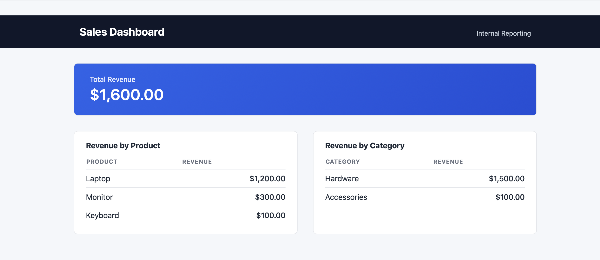

PHP Sales Dashboard

A backend-focused sales dashboard built with PHP and SQL to visualize and manage sales data.

Screenshots

Tech Stack
- PHP
- SQL (MySQL)
- HTML, CSS (basic UI)

Features
- View sales summaries
- Filter data by date or product
- Backend-driven data handling

Notes
This project is backend-focused and not deployed. Code and screenshots demonstrate functionality.
